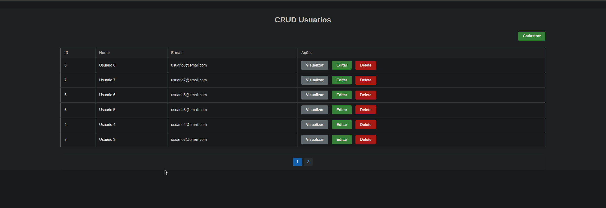

<a href="README.md" title="Versão em Português"></a>
# User CRUD - Object Oriented PHP

This project is a simple CRUD (Create, Read, Update, Delete) for user management, developed in object-oriented PHP, using MySQL, HTML, CSS, and JavaScript. The goal is to serve as a base for learning and practicing fundamental web development concepts.



## Technologies Used
- PHP (OOP)
- MySQL
- HTML5
- CSS3
- JavaScript

## Project Structure
```
proj_crud_php_oo/
├── assets/           # Static files (CSS, images)
├── conection/        # Database connection class
│   └── Connection.php
├── controller/       # User actions controller
│   └── UserController.php
├── model/            # User data model
│   └── User.php
├── views/            # CRUD pages
│   ├── create.php
│   ├── edit.php
│   ├── view.php
│   └── delete.php
├── index.php         # Main page (listing and pagination)
└── README.md         # Project documentation
```

## Installation & Usage
1. Clone this repository:
   ```bash
   git clone https://github.com/robson-luiz/proj_crud_php_oo.git
   ```
2. Import the SQL script below into your MySQL to create the database and table **or** simply import the backup located in the `db` folder:
    - To import manually, use the script:
       ```sql
       CREATE DATABASE IF NOT EXISTS practice_crud CHARACTER SET utf8mb4 COLLATE utf8mb4_unicode_ci;
       USE practice_crud;
       CREATE TABLE IF NOT EXISTS users (
             id INT AUTO_INCREMENT PRIMARY KEY,
             name VARCHAR(100) NOT NULL,
             email VARCHAR(100) NOT NULL
       ) ENGINE=InnoDB DEFAULT CHARSET=utf8mb4 COLLATE=utf8mb4_unicode_ci;
       ```
    - To import the backup, use your database manager (phpMyAdmin, MySQL Workbench, etc.) and select the `.sql` file from the `db` folder.
3. Configure database access in `conection/Connection.php` (user, password, host).
4. Run the project on a local server (XAMPP, LAMP, WAMP, etc.) and access `index.php` in your browser.

## How to Use
- **Create:** Click "Cadastrar" to add a new user.
- **View:** Click "Visualizar" to see user details.
- **Edit:** Click "Editar" to edit user data.
- **Delete:** Click "Delete" to remove a user.
- **Pagination:** If there are more than 6 users, use the pagination controls.

## License
This project is free to use and modify. Choose the license you prefer (MIT, GPL, etc.).

---
Project created for study and practice of web development with PHP, MySQL, HTML, CSS, and JavaScript.
